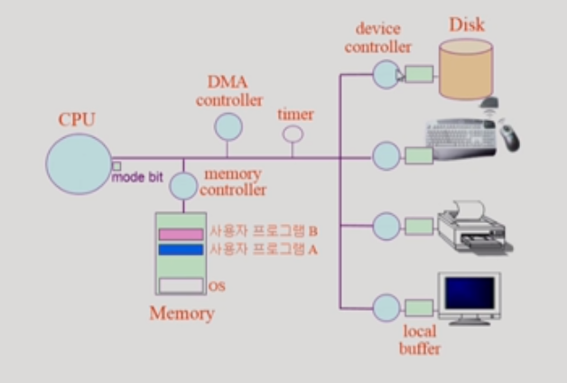
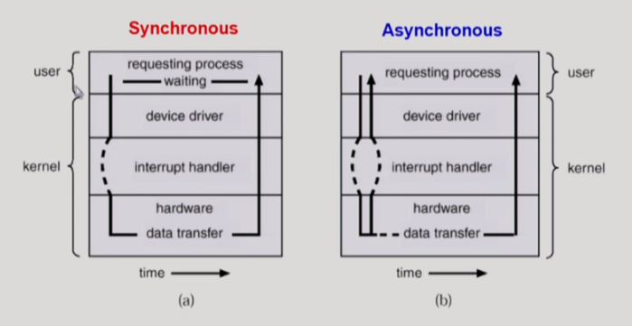
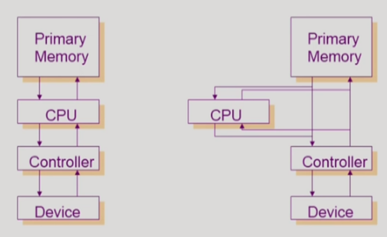
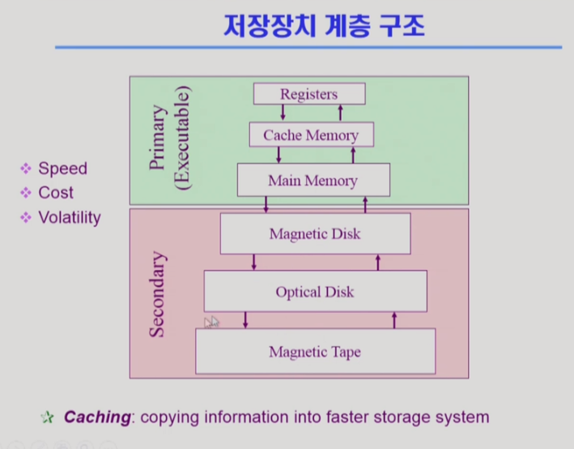
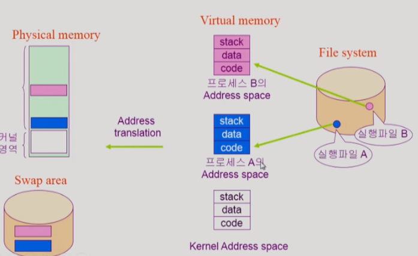
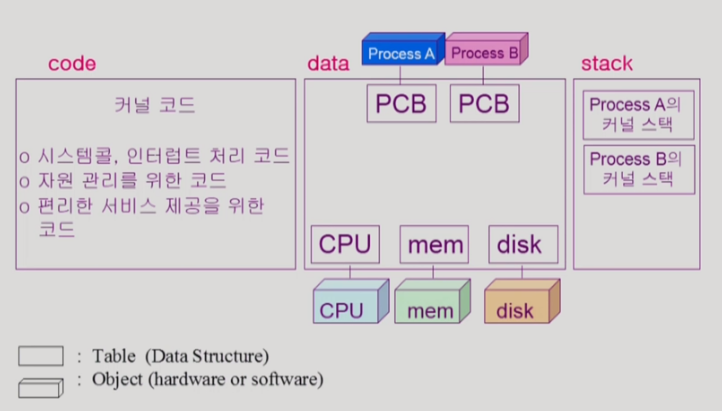
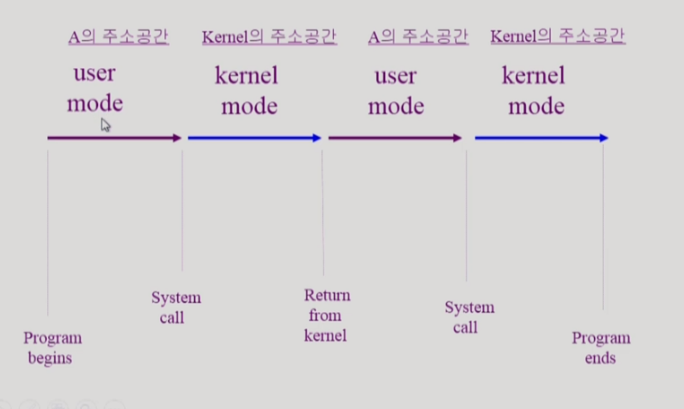

# 운영체제란 무엇인가?

## 1. 운영체제

컴퓨터 하드웨어 바로 위에 설치되어 사용자 및 다른 모든 소프트웨어와 하드웨어를 연결하는  소프트웨어 계층


1. 협의의 운영체제 => 커널 (전공자입장의 운영체제)
   - 운영체제의 핵심 부분으로 메모리에 상주하는 부분
2. 광의의 운영체제
   - 커널 뿐 아니라 각종 주변 시스템 유틸리티를 포함한 개념


### 1. 운영체제의 목적

1. 컴퓨터 시스템을 편리하게 사용할 수 있는 환경을 제공
   - 운영체제는 동시 사용자 / 프로그램들이 각각 독자적 컴퓨터에서 수행되는 것 같은 환상을 제공
   - 하드웨어를 직접 다루는 복잡한 부분을 운영체제가 대행
2. 컴퓨터 시스템의 **자원을 효율적**으로 관리
   - 프로세서, 기억장치, 입출력 장치 등의 효율적 관리	
     - 사용자간의 형평성 있는 자원 분배
     - 주어진 자원으로 최대한의 성능을 내도록
   - 사용자 및 운영체제 자신의 보호
   - 프로세스, 파일, 메시지 등을 관리

- 프로세서, 기억장치, 


### 2. 운영체제의 분류

#### 1. 동시 작업 가능 여부

1. 단일 작업
   - 한번에 하나의 작업만 처리
     - MS-DOS 프롬프트 상에서는 한 명령의 수행을 끝내기 전에 다른 명령을 수행시킬 수 없음
2. 다중 작업
   - 동시에 두 개 이상의 작업 처리
     - UNIX, MS Windows 등에서는 한 명령의 수행이 끝나기 전에 다른 명령이나 프로그램을 수행할 수 있음

#### 2. 사용자의 수

컴퓨터 한대를 여러 사용자가 이용 가능 한지

1. 단일 사용자
   - MS-DOS, MS Windows
2. 다중 사용자
   - UNIX, NT Server

#### 3. 처리방식

1. 일괄 처리 (batch process)
   - 현대 운영체제에는 잘 볼 수 없음
   - 작업 요청의 일정량을 모아서 한꺼번에 처리
   - 작업이 완전 종료될 때까지 기다려야함
2. 시분할 (time sharing)
   - 여러 작업을 수행할 때 컴퓨터 처리 능력을 일정한 시간 단위로 분할하여 사용
   - 일괄 처리 시스템에 비행 짧은 응답 시간을 가짐
   - 일반적으로 우리가 다루는 OS
     - UNIX
   - interactive한 방식
3. 실시간 (Realtime OS)
   - 정해진 시간 안에 어떠한 일이 반드시 종료됨이 보장되어야 하는 실시간시스템을 위한 OS
   - 주로 특수한 목적을 가진 시스템에서 사용
     - 원자로, 공장제어, 미사일 제어, 반도체 장비, 로보트 제어

- **실시간 시스템의 개념 확장**
  - Hard realtime system(경성 실시간 시스템) - 시간을 지키지 않았을 때 큰 이슈가 있는 경우(반도체)
  - Soft realtime system(연성 실시간 시스템) - 시간을 지키지 않았을 때 큰 이슈가 없는 경우 (미디어)


#### + 혼동되는 용어들

-  Multitasking : 여러 프로그램이 동시에 실행되는 것
- Multiprogramming : 하나의 메모리에 여러개의 프로그램이 올라 가는 것
- Time sharing : 시간을 여러 프로그램들이 공유한 것 (멀티태스킹과 비슷하지만 CPU 성능 측면을 강조한 말)
- Multiprocess
- 구분
  - 위의 용어들은 컴퓨터에서 여러 작업을 동시에 수행하는 것을 뜻한다.
- **Multiprocessor**
  - 하나의 컴퓨터에 CPU(processor)가 여러 개 붙어 있음을 의미


### 3. 운영체제의 예

#### 1. 유닉스 (UNIX)

- 코드의 대부분을 C언어로 사용
- 높은 이식성 (하나의 컴퓨터에 적용된 운영체제를 다른 기계에 적용시키기 쉬움 (C언어 영향))
- 최소한의 커널 구조
- 복잡한 시스템에 맞게 확장 용이
- 소스 코드 공개
- 프로그램 개발에 용이
- 다양한 버전
  - System V, FreeBSD, SunOS, Solaris
  - Linux -> 개인 컴퓨터에 사용하기 용이

#### 2. Windows - DOS

- MS사에서 1981년 IBM-PC를 위해 개발
- 단일 사용자용 운영체제, 메모리 관리 능력의 한계 (주 기억 장치 :640KB)

#### 3. MS Windows

- MS사의 다중 작업용 GUI 기반 운영 체제
- Plug and Play, 네트워크 환경 강화
- DPS용 응용프로그램과 호환성 제공
- 불안정성
- 풍부한 자원 소프트웨어

####  + Handheld device 등...


### + 운영체제의 구조


###  4. 컴퓨터 시스템 구조




#### 1. Modebit

- 사용자 프로그램의 잘못된 수행으로 다른 프로그램 및 운영체제에 피해가 가지 않도록 하기 위한 보호 장치 필요

- Mode bit을 통해 하드웨어적으로 두가지 모드의 operation 지원

  ```
  1 - 사용자모드 : 사용자 프로그램 수행
  0 - 모니터모드(=커널모드) : OS 코드 수행
  ```

  - 보안을 해칠  수 있는 중요한 명령어는 모니터 모드에서만 수행 가능한 특권명령으로 규정
  - Interrupt나 Excption 발생시 하드웨어가 mode bit을 0으로 바꿈
  - 사용자 프로그램에게 CPU를 넘기기 전에 mode bit을 1로 셋팅

#### 2. Timer

- 타이머
  - 정해진 시간이 흐른 뒤 운영체제에게 제어권이 넘어가도록 인터럽트를 발생시킴
  - 타이머는 매 클럭 틱 때마다 1씩 감소
  - 타이머 값이 0이 되면 타이머 인터럽트 발생
  - CPU를 특정 프로그램이 독점하는 것으로부터 보호
- 타이머는 Time Sharing을 구현하기 위해 널리 이용됨
- 타이머는 현재 시간을 계산하기 위해서도 사용

#### 3. Device Controller

- I/O device controller
  - 해당 I/O 장치 유형을 관리하는 일종의 작은 CPU
  - 제어 정보를 위해 control register, status register를 가짐
  - local buffer를 가짐
- I/O는 실제 device와 local buffer 사이에서 일어남
- Device controller는 I/O가 끝났을 경우 interrupt로 CPU에 그 사실을 알림


		+ device driver(장치구동기) : OS코드 중 각 장치별 처리 루틴 > software
		+ device controller(장치제어기) : 각 장치를 통제하는 일종의 작은 CPU 

#### 4. 입출력(I/O)의 수행

- 모든 입출력 명령은 특권 명령
- 사용자 프로그램은 어떻게 I/O를 하는가?
  - 시스템콜
    - 사용자 프로그램은 운영체제에게 I/O 요청
  - trap을 사용하여 인터럽트 벡터의 특정 위치로 이동
  - 제어권이 인터럽트 벡터가 가리키는 인터럽트 서비스 루틴으로 이동
  - 올바른 I/O 요청인지 확인 후 I/O 수행
  - I/O완료 시 제어권을 시스템콜 다음 명령으로 옮김

#### 5. 인터럽트(Interrupt)

- 인터럽트
  - **현대의 운영체제는 인터럽트에 의해 구동됨**
  - 인터럽트 당한 시점의 레지스터와 program counter를 save 한 후 CPU의 제어를 인터럽트 처리 루틴에 넘긴다
- 넓은 의미의 Interrupt
  - Interupt(하드웨어 인터럽트) : 하드웨어가 발생시킨 인터럽트
  - Trap(소프트웨어 인터럽트)
    - Exception : 프로그램이 오류를 범한 경우
    - System call : 프로그램이 커널 함수를 호출하는 경우(사용자 프로그램이 I/O를 필요로 하는 경우)
- 인터럽트 관련용어
  - 인터럽트 벡터 
    - 해당 인터럽트의 처리 루틴 주소(어떤 인터럭트를 실행시켜야 할지 위치)를 가지고 있음
  - 인터럽트 처리 루틴(인터럽트 핸들러)
    - 해당 인터럽트를 처리하는 커널 함수

#### 6. 시스템 콜

- 사용자 프로그램이 운영체제의 서비스를 받기 위해 커널 함수를 호출 하는 것

#### 7. 동기식 입출력과 비동기식 입출력

- 동기식 입출력 (synchronous I/O)

  - I/O 요청 후 입출력 작업이 완료된 후에야 제어가 사용자 프로그램에 넘어감
  - 구현방법 1
    - I / O 가 끝날  때 까지 CPU를 낭비시킴
    - 매시점 하나의 I/O만 일어날 수 있음
  - 구현 방법 2
    - I/O가 완료될 때까지 해당 프로그램에게서 CPU를 빼앗음
    - I/O 처리를 기다리는 줄에 그 프로그램을 줄 세움
    - 다른 프로그램에게 CPU를 줌

- 비동기식 입출력 (asynchronous I/O)

  - I/O가 시작된 후 입출력 작업이 끝나기를 기다리지 않고 제어가 사용자 프로그램에 즉시 넘어감

    

  - 인터럽트를 통해서 I/O작업이 끝났음을 알림

#### 8. DMA(Direct Memory Access)

- 모든 I/O장치가 인풋이 들어올때마다 CPU에게 interrupt를 걸어서 메모리 저장을 요청하면 CPU낭비가 심함
- 이를 방지하기 위해 I/O가 DMA를 통해 메모리에 접근 할 수 있도록 하였음
- 빠른 입출력 장치를 메모리에 가까운 속도로 처리하기 위해 사용
- CPU의 중재없이 device controller가 device의 buffer storage의 내용을 메모리에 block단위로 직접 전송
- 바이트 단위가 아니라 block단위로 인터럽트를 발생시킴



#### 9. 서로다른 입출력 명령어

- I/O를 수행하는 special instruction에 의해 : 메모리
- Memory Mapped I/O에 의해 : I/O장치역시 메모리 장치의 연장주소를 붙여서 활용


### 3. 저장장치 계층 구조



- 위로갈수록 속도가 빠르지만, 용량이 적음
- 연두색 : 휘발성, CPU가 직접 접근 / 분홍 : 비휘발성, CPU접근 불가
  - Caching : 자주쓰는 정보를 저장해서 빠르게 사용할 수 있도록 하는 메모리


### 4. 프로그램의 실행(메모리 Load)



#### 1. 커널 주소 공간의 내용



#### 2. 사용자 프로그램이 사용하는 함수

- 함수
  - 사용자 정의 함수
    - 자신의 프로그램에서 정의한 함수
  - 라이브러리 함수
    - 자신의 프로그램에서 정의하지 않고 갖다 쓴 함수
    - 자신의 프로그램의 실행 파일에 포함되어 있다.
  - 커널 함수
    - 운영체제 프로그램의 함수
    - 커널 함수의 호출 = 시스템 콜

