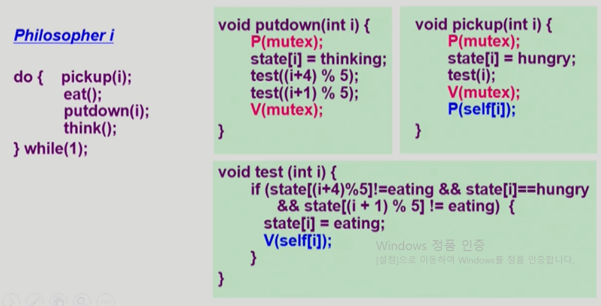

# 운영체제

## 1. 운영체제

컴퓨터 하드웨어 바로 위에 설치되어 사용자 및 다른 모든 소프트웨어와 하드웨어를 연결하는  소프트웨어 계층


1. 협의의 운영체제 => 커널 (전공자입장의 운영체제)
   - 운영체제의 핵심 부분으로 메모리에 상주하는 부분
2. 광의의 운영체제
   - 커널 뿐 아니라 각종 주변 시스템 유틸리티를 포함한 개념


### 1. 운영체제의 목적

1. 컴퓨터 시스템을 편리하게 사용할 수 있는 환경을 제공
   - 운영체제는 동시 사용자 / 프로그램들이 각각 독자적 컴퓨터에서 수행되는 것 같은 환상을 제공
   - 하드웨어를 직접 다루는 복잡한 부분을 운영체제가 대행
2. 컴퓨터 시스템의 **자원을 효율적**으로 관리
   - 프로세서, 기억장치, 입출력 장치 등의 효율적 관리	
     - 사용자간의 형평성 있는 자원 분배
     - 주어진 자원으로 최대한의 성능을 내도록
   - 사용자 및 운영체제 자신의 보호
   - 프로세스, 파일, 메시지 등을 관리

- 프로세서, 기억장치, 


### 2. 운영체제의 분류

#### 1. 동시 작업 가능 여부

1. 단일 작업
   - 한번에 하나의 작업만 처리
     - MS-DOS 프롬프트 상에서는 한 명령의 수행을 끝내기 전에 다른 명령을 수행시킬 수 없음
2. 다중 작업
   - 동시에 두 개 이상의 작업 처리
     - UNIX, MS Windows 등에서는 한 명령의 수행이 끝나기 전에 다른 명령이나 프로그램을 수행할 수 있음

#### 2. 사용자의 수

컴퓨터 한대를 여러 사용자가 이용 가능 한지

1. 단일 사용자
   - MS-DOS, MS Windows
2. 다중 사용자
   - UNIX, NT Server

#### 3. 처리방식

1. 일괄 처리 (batch process)
   - 현대 운영체제에는 잘 볼 수 없음
   - 작업 요청의 일정량을 모아서 한꺼번에 처리
   - 작업이 완전 종료될 때까지 기다려야함
2. 시분할 (time sharing)
   - 여러 작업을 수행할 때 컴퓨터 처리 능력을 일정한 시간 단위로 분할하여 사용
   - 일괄 처리 시스템에 비행 짧은 응답 시간을 가짐
   - 일반적으로 우리가 다루는 OS
     - UNIX
   - interactive한 방식
3. 실시간 (Realtime OS)
   - 정해진 시간 안에 어떠한 일이 반드시 종료됨이 보장되어야 하는 실시간시스템을 위한 OS
   - 주로 특수한 목적을 가진 시스템에서 사용
     - 원자로, 공장제어, 미사일 제어, 반도체 장비, 로보트 제어

- **실시간 시스템의 개념 확장**
  - Hard realtime system(경성 실시간 시스템) - 시간을 지키지 않았을 때 큰 이슈가 있는 경우(반도체)
  - Soft realtime system(연성 실시간 시스템) - 시간을 지키지 않았을 때 큰 이슈가 없는 경우 (미디어)


#### + 혼동되는 용어들

-  Multitasking : 여러 프로그램이 동시에 실행되는 것
- Multiprogramming : 하나의 메모리에 여러개의 프로그램이 올라 가는 것
- Time sharing : 시간을 여러 프로그램들이 공유한 것 (멀티태스킹과 비슷하지만 CPU 성능 측면을 강조한 말)
- Multiprocess
- 구분
  - 위의 용어들은 컴퓨터에서 여러 작업을 동시에 수행하는 것을 뜻한다.
- **Multiprocessor**
  - 하나의 컴퓨터에 CPU(processor)가 여러 개 붙어 있음을 의미


### 3. 운영체제의 예

#### 1. 유닉스 (UNIX)

- 코드의 대부분을 C언어로 사용
- 높은 이식성 (하나의 컴퓨터에 적용된 운영체제를 다른 기계에 적용시키기 쉬움 (C언어 영향))
- 최소한의 커널 구조
- 복잡한 시스템에 맞게 확장 용이
- 소스 코드 공개
- 프로그램 개발에 용이
- 다양한 버전
  - System V, FreeBSD, SunOS, Solaris
  - Linux -> 개인 컴퓨터에 사용하기 용이

#### 2. Windows - DOS

- MS사에서 1981년 IBM-PC를 위해 개발
- 단일 사용자용 운영체제, 메모리 관리 능력의 한계 (주 기억 장치 :640KB)

#### 3. MS Windows

- MS사의 다중 작업용 GUI 기반 운영 체제
- Plug and Play, 네트워크 환경 강화
- DPS용 응용프로그램과 호환성 제공
- 불안정성
- 풍부한 자원 소프트웨어

####  + Handheld device 등...


### + 운영체제의 구조


###  4. 컴퓨터 시스템 구조


#### 1. Modebit

- 사용자 프로그램의 잘못된 수행으로 다른 프로그램 및 운영체제에 피해가 가지 않도록 하기 위한 보호 장치 필요

- Mode bit을 통해 하드웨어적으로 두가지 모드의 operation 지원

  ```
  1 - 사용자모드 : 사용자 프로그램 수행
  0 - 모니터모드(=커널모드) : OS 코드 수행
  ```

  - 보안을 해칠  수 있는 중요한 명령어는 모니터 모드에서만 수행 가능한 특권명령으로 규정
  - Interrupt나 Excption 발생시 하드웨어가 mode bit을 0으로 바꿈
  - 사용자 프로그램에게 CPU를 넘기기 전에 mode bit을 1로 셋팅

#### 2. Timer

- 타이머
  - 정해진 시간이 흐른 뒤 운영체제에게 제어권이 넘어가도록 인터럽트를 발생시킴
  - 타이머는 매 클럭 틱 때마다 1씩 감소
  - 타이머 값이 0이 되면 타이머 인터럽트 발생
  - CPU를 특정 프로그램이 독점하는 것으로부터 보호
- 타이머는 Time Sharing을 구현하기 위해 널리 이용됨
- 타이머는 현재 시간을 계산하기 위해서도 사용

#### 3. Device Controller

- I/O device controller
  - 해당 I/O 장치 유형을 관리하는 일종의 작은 CPU
  - 제어 정보를 위해 control register, status register를 가짐
  - local buffer를 가짐
- I/O는 실제 device와 local buffer 사이에서 일어남
- Device controller는 I/O가 끝났을 경우 interrupt로 CPU에 그 사실을 알림


		+ device driver(장치구동기) : OS코드 중 각 장치별 처리 루틴 > software
		+ device controller(장치제어기) : 각 장치를 통제하는 일종의 작은 CPU 

#### 4. 입출력(I/O)의 수행

- 모든 입출력 명령은 특권 명령
- 사용자 프로그램은 어떻게 I/O를 하는가?
  - 시스템콜
    - 사용자 프로그램은 운영체제에게 I/O 요청
  - trap을 사용하여 인터럽트 벡터의 특정 위치로 이동
  - 제어권이 인터럽트 벡터가 가리키는 인터럽트 서비스 루틴으로 이동
  - 올바른 I/O 요청인지 확인 후 I/O 수행
  - I/O완료 시 제어권을 시스템콜 다음 명령으로 옮김

#### 5. 인터럽트(Interrupt)

- 인터럽트
  - **현대의 운영체제는 인터럽트에 의해 구동됨**
  - 인터럽트 당한 시점의 레지스터와 program counter를 save 한 후 CPU의 제어를 인터럽트 처리 루틴에 넘긴다
- 넓은 의미의 Interrupt
  - Interupt(하드웨어 인터럽트) : 하드웨어가 발생시킨 인터럽트
  - Trap(소프트웨어 인터럽트)
    - Exception : 프로그램이 오류를 범한 경우
    - System call : 프로그램이 커널 함수를 호출하는 경우(사용자 프로그램이 I/O를 필요로 하는 경우)
- 인터럽트 관련용어
  - 인터럽트 벡터 
    - 해당 인터럽트의 처리 루틴 주소(어떤 인터럭트를 실행시켜야 할지 위치)를 가지고 있음
  - 인터럽트 처리 루틴(인터럽트 핸들러)
    - 해당 인터럽트를 처리하는 커널 함수

#### 6. 시스템 콜

- 사용자 프로그램이 운영체제의 서비스를 받기 위해 커널 함수를 호출 하는 것

#### 7. 동기식 입출력과 비동기식 입출력

- 동기식 입출력 (synchronous I/O)

  - I/O 요청 후 입출력 작업이 완료된 후에야 제어가 사용자 프로그램에 넘어감
  - 구현방법 1
    - I / O 가 끝날  때 까지 CPU를 낭비시킴
    - 매시점 하나의 I/O만 일어날 수 있음
  - 구현 방법 2
    - I/O가 완료될 때까지 해당 프로그램에게서 CPU를 빼앗음
    - I/O 처리를 기다리는 줄에 그 프로그램을 줄 세움
    - 다른 프로그램에게 CPU를 줌

- 비동기식 입출력 (asynchronous I/O)

  - I/O가 시작된 후 입출력 작업이 끝나기를 기다리지 않고 제어가 사용자 프로그램에 즉시 넘어감

    

  - 인터럽트를 통해서 I/O작업이 끝났음을 알림

#### 8. DMA(Direct Memory Access)

- 모든 I/O장치가 인풋이 들어올때마다 CPU에게 interrupt를 걸어서 메모리 저장을 요청하면 CPU낭비가 심함
- 이를 방지하기 위해 I/O가 DMA를 통해 메모리에 접근 할 수 있도록 하였음
- 빠른 입출력 장치를 메모리에 가까운 속도로 처리하기 위해 사용
- CPU의 중재없이 device controller가 device의 buffer storage의 내용을 메모리에 block단위로 직접 전송
- 바이트 단위가 아니라 block단위로 인터럽트를 발생시킴


#### 9. 서로다른 입출력 명령어

- I/O를 수행하는 special instruction에 의해 : 메모리
- Memory Mapped I/O에 의해 : I/O장치역시 메모리 장치의 연장주소를 붙여서 활용


### 3. 저장장치 계층 구조


- 위로갈수록 속도가 빠르지만, 용량이 적음
- 연두색 : 휘발성, CPU가 직접 접근 / 분홍 : 비휘발성, CPU접근 불가
  - Caching : 자주쓰는 정보를 저장해서 빠르게 사용할 수 있도록 하는 메모리


### 4. 프로그램의 실행(메모리 Load)


#### 1. 커널 주소 공간의 내용


#### 2. 사용자 프로그램이 사용하는 함수

- 함수
  - 사용자 정의 함수
    - 자신의 프로그램에서 정의한 함수
  - 라이브러리 함수
    - 자신의 프로그램에서 정의하지 않고 갖다 쓴 함수
    - 자신의 프로그램의 실행 파일에 포함되어 있다.
  - 커널 함수
    - 운영체제 프로그램의 함수
    - 커널 함수의 호출 = 시스템 콜


---


## 2. 프로세스

### 1. 프로세스의 개념

 Process is a program in execution

- 프로세스의 문맥(현재상태를 표현하기 위함)
  - CPU의 수행상태를 나타내는 하드웨어 문맥
    - Program Counter
    - 각종 register
    - 주로 register가 어떤 값을 가지고 있었는가?
  - 프로세스의 주소 공간(메모리와 관련)
    - code, data, stack
    - 어떤 데이터가 들어가 있는지?
  - 프로세스 관련 커널 자료 구조
    - PCB(Process Control Block)
    - Kernel Stack
    - 운영체제가 이 프로세스에 대해 어떻게 평가하고 있는지?


### 2. 프로세스의 상태 (Process State)

- 프로세스는 상태(state)가 변경되며 수행된다
  - Runnig
    - CPU를 잡고 instruction을 수행중인 상태
  - Ready
    - CPU를 기다리는 상태(다른 모든 중비는 완료되어야함 (메모리 등))
  - Blocked(wait, sleep)
    - CPU를 주어도 당장 instruction을 수행할 수 없는 상태
    - Process 자신이 요청한 event(I/O작업) 가 즉시 만족되지 않아 이를 기다리는 상태
  - Suspended(stopped)
    - 외부적인 이유로 프로세스의 수행이 정지된 상태 (중기 스케줄러에 의해)
    - 프로세스는 통째로 디스크에 swap out 된다/
  - New : 프로세스가 생성중인 상태
  - Terminated : 수행이 끝난 상태
  
  Block : 자신이 요청한 event가 만족되면 Ready
  
  Suspended : 외부에서 resume(메모리를 다시 주어야) Active


### 3. Process Control Block (PCB)

 

- 운영체제가 각 프로세스를 관리하기 위해 프로세스당 유지하는 정보
- 다음의 구성 요소를 가진다 (구조체로 유지)
  - (1) OS가 관리상 사용하는 정보
  - (2) CPU 수행 관련 하드웨어 값
  - (3) 메모리 관련 (code, data, stack의 위치정보)
  - (4) 파일 관련


### 4. Context Switch

- CPU를 한 프로세스에서 다른 프로세스로 넘겨주는 과정
- CPU가 다른 프로세스에게 넘어갈 때 운영체제는 다음을 수행
  - CPU를 내어주는 프로세스의 상태를 그 프로세스의 PCB(커널)에 저장
  - CPU를 새롭게 얻는 프로세스의 상태를 PCB에서 읽어옴


- **System call이나 Interrupt 발생시 context switch가 일어나는 것은 아님**
  - Context Switch란 Process의 CPU점유 변경 상태를 말한다
  - 1번처럼 ISR / System call 함수로 인해 OS한테 점유가 갔다가 돌아오는 것은 문맥변경이 아님


### 5. 프로세스를 스케줄링하기 위한 큐


- 
- - 


### 6. 스케줄러 (Scheduler)

1. Long-term scheduler (장기 스케줄러 or Job Scheduler)
   - 시작 프로세스(New) 중 어떤 것들을 ready queue로 보낼지 결정
   - 프로세스에 memory을 주는 문제
   - degree of Multiprogramming을 제어
   - time sharing system에는 보통 장기 스케줄러가 없음 (무조건 ready queue로 감 -> 메모리를 무조건 받음)
2. Short-term scheduler(단기 스케줄러 or CPU scheduler)
   - 어떤 프로세스를 다음번에 running시킬지 결정
   - 프로세스에 CPU를 주는 문제
   - 충분히 빨라야함
3. Medium-Term Scheduler (중기 스케줄러 or Swapper)
   - 여유 공간 마련을 위해 일부 프로세스를 선택하여 프로세스를 통째로 메모리에서 디스크로 쫒아냄
   - 프로세스에게서  memory를 뺏는 문제
   - degree of Multiprograming


### 7. 프로세스 상태도


### 8. Thread

- 프로세스 하나에서 공유할 수 있는 것은 최대한 공유하고 CPU수행과 관련된 정보만 별도로 가짐
- A thread is basic unit of CPU uitilization
- Thread의 구성 -> Thread들이 독립적으로 가지는 것들(CPU수행과 관련된 것)
  - program counter
  - reguster set
  - stack space
- Thread가 동료 thread와 공유하는 부분(=task)
  - code section
  - data section
  - OS resources
- 전통적인 개념의 heavyweight process는 하나의 thread를 가지고 있는 task로 볼 수 있다.
- 다중 스레드로 구성된 태스크 구조에서는 하나의 서버 스레드가 blocked 상태인 동안에도 동일한 태스크 내의 다른 스레드가 실행되어 빠른 처리를 할 수 있다.
  - EX
  - 웹페이지를 읽어오는 동안 웹브라우저는 blocked 상태임 (I/O)를 기다리는 중
  - 웹 브라우저가 여러개의 스레드로 형성 돼 있다면, 하나의 스레드가 이미지를 불러오며 blocked 상태일 때, 다른 스레드가 텍스트와 같은 컨텐츠를 렌더링 하여 빠른 응답 제공 가능
- 동일한 일을 수행하는 다중스레드가 협력하여 높은 처리율과 성능향상을 얻을 수 있다.
- 스레드를 사용하면 병렬성을 높일 수 있다


#### 1. 스레드의 장점 정리

- Responsivenss 
  - 반응성이 좋아짐

- Resouce Sharing 
  - Code Section / Data Section / OS resouces 등을 공유
- Economy 
  - 같은 작업이라면 여러개의 프로세스보다 여러개의 스레드가 유리
- Utilization of MP Architectures
  - 멀티 프로세서 환경에서도 효율적으로 실행 가능


### 9. Process Management

- Copy-on-Write(COW) : 간단히 말해서 write가 발생했을 때 code / data / stack을 복사하여 사용
- 부모 프로세스가 자식프로세스를 생성
- 프로세스의 트리(계층 구조) 형성
- 프로세스는 자원을 필요로 함
  - 운영체제로부터 받는다
  - 부모와 공유한다
- 자원의 공유
  - 부모와 자식이 모든 자원을공유하는 모델
  - 일부를 공유하는 모델
  - 전혀 공유하지 않는 모델 (보통은 이런 관계가 됨)
- 수행
  - 부모와 자식은 공존하며 수행되는 모델
  - 자식이 종료될 때까지 부모가 기다리는 모델

#### 1. 프로세스 생성

- 주소 공간
  - 자식은 부모의 공간을 복사함
  - 자식은 그 공간에 새로운 프로그램을 올림
- 유닉스의 예
  - fork () 시스템 콜이 새로운 프로세스를 생성
    - 부모를 그대로 복사
    - 주소 공간 할당
  - fork 다음 exec() 시스템 콜을 통해 새로운 프로그램을 메모리에 올림

#### 2.  프로세스 종료

- 프로세스가 마지막 명령을 수행한 후 운영체제에게 이를 알려줌(exit)
  - 자식이 부모에게 output data를 보냄
  - 프로세스의 각종 자원들이 운영체제에게 반납됨
- 부모 프로세스가 자식의 수행을 종료시킴(abort)
  - 자식이 할당 자원의 한계치를 넘어섬
  - 자식에게 할당된 태스크가 더 필요하지 않음
  - 부모가 종료(exit)하는 경우
    - 운영체제는 부모 프로세스가 종료하는 경우 자식이 더 이상 수행되도록 두지 않는다
    - 단계적인 종료

#### 3. fork() 시스템 콜


- fork() 시스템 콜 이후로 자식프로세스가 생성됨

  

  - 위 상태 처럼 fork위치에서 자식 프로세스가 생성되며 자식 프로세스는 부모프로세스의 프로그램 카운터를 복사하여 pid=fork() 아래의 위치에서 실행하게 됨
  - fork를 했을 때, 운영체제가 자식 프로세스와 부모프로세스를 구분하기 위해 return 값을 달리준다(주로 부모는 양수, 자식은 0)


#### 4. exec() 시스템 콜


- 자식프로세스에게 execlp를 활용하여 새로운 프로그램을 실행하도록 함
- execlp함수를 쓰면 그 아래의 코드를 덮어 씌우기 때문에 사라지게 됨


#### 5. wait() 시스템 콜

- 프로세스 A가 wait() 시스템 콜을 호출하면
  - 커널은 child가 종료될 때 까지 프로세스  A를 sleep시킨다 (block상태)
  - Child process가 종료되면 커널은 프로세스 A를 깨운다 (ready 상태)
- 자식이 종료될 때 까지 부모 프로세스를 기다리게 할 때 사용하는 것


#### 6. exit() 시스템 콜

- 프로세스의 종료
  - 자발적 종료
    - 마지막 statement 수행 후 exit() 시스템 콜을 통해
    - 컴파일러가 끝났을 때 자동으로 종료됨
  - 비자발적 종료
    - 부모 프로세스가 자식 프로세스를 강제종료 시키는 경우
      - 자식 프로세스가 한계를 넘어서는 자원 요청
    - 사용자의 강제 종료
    - 부모가 종료하는 경우


#### 7. 프로세스 간 협력

- 독립적 프로세스

  - 프로세스는 각자의 주소 공간을 가지고 수행되므로 원칙적으로 하나의 프로세스는 다른 프로세스의 수행에 영향을 미치지 못함

- 협력 프로세스

  - 프로세스 협력 메커니즘을 통해 하나의 프로세스가 다른 프로세스의 수행에 영향을 미칠 수 있음

- 프로세스간 협력 메커니즘(IPC : interprocess Communication)

  - 메시지를 전달하는 방법

    - message passing : 커널을 통해 메시지 전달

  - 주소 공간을 공유하는 방법

    - shared memory : 서로 다른 프로세스 간에도 일부 주소 공간을 공유 하게 하는 shared memory 메커니즘

    

    - thread : thread는 사실상 하나의 프로세스이므로 프로세스 간 협력으로 보기는 어렵지만 동일한 process를 구성하는 thread들 간에는 주소 공간을 공유하므로 협력이 가능

    

#### 8. Message Passing

- Message System

  -  프로세스 사이에 공유변수를 일체 사용하지 않고 통신하는 시스템
  - 메시지를 전달할 때는 커널을 통해서 전달함

- Dircet Communication

  - 통신하려는 프로세스의 이름을 명시적으로 표시

  

- Indirect Communication

  - mailbox(또는 port)를 통해 메시지를 간접 전달

  


#### 9. CPU-burst-Time의 분포


- 여러 종류의 Job이 섞여 있기 때문에 CPU 스케줄링이 필요하다
  - I/O bound job은 주로 이용자와 인터렉트 하는 작업인데 너무 오래기다리지 않게 CPU스케줄링이 필요함
  - CPU와 I/O 장치 등 시스템 자원을 골고루 효율적으로 사용
- 프로세스는 그 특성에 따라 다음 두 가지로 나눔
  - I / O bound process
    - CPU를 잡고 계산하는 시간보다 I / O에 더 많은 시간이 필요한 job
  - CPU-bound process
    - 계산 위주의 job

#### 10. CPU Scheduler & Dispatcher

- CPU Scheduler (누구에게 CPU를 줄지 결정)

  - Ready 상태의 프로세스 중에서 이번에 CPU를 줄 프로세스를 고른다

- Dispatcher (CPU를 주는 과정)

  - CPU의 제어권을 CPU scheduler에 의해 선택된 프로세스에게 넘긴다
  - 이 과정을 context switch(문맥 교환)라고 한다


+ 선점형 스케줄링 vs 비선점형 스케줄링(강제로 빼앗지 않음)


### 10. CPU Scheduling

- CPU Utilization (이용률)
  - 전체시간 중 CPU가 일 한 시간
  - 최대한 CPU가 계쏙 일하는 것이 좋음
- Throughput(처리량)
  - 주어진 시간 동안 완료한 작업량

```아래 세개는 프로세스의 입장에서의 성능이다```

- Turnaround time (소요시간, 변환시간)
  - CPU burst가 끝나고 나갈때 까지 시간
- Waiting time(대기시간)
  -  CPU를 기다린 시간
  - 비선점형인 경우 CPU를 뺏겻을 때 기다린 시간도 포함된다
- Response time(응답시간)
  - Ready Queue에 들어와서 처음으로 .CPU를 받기까지의 시간
  - 처음 CPU를 받기까지 기다린 시간으로 waiting time과 차이가 있다.
  - TimeSharing 방식의 컴퓨터에서 중요한 문제

#### 1. FCFS (First-Come First-Served)

- 먼저 온 순서대로 처리하는 방식
- 비선점형 스케줄링 방식이다.

+ 들어온 순서에 따라 대기시간의 차이가 커질 수 있다.
  + Convoy effect

#### 2. SJF (Shortest-Job-First)

- 각 프로세스와 다음번 CPU burst time을 가지고 스케줄링에 활용

- CPU burst time이 가장 짧은 프로세스를 먼저 스케줄

- Two schemes:

  - Nonpreemptive(비선점)
    - 일단 CPU를 잡으면 이번 CPU burst가 완료될 때까지 CPU를 선점당하지 않음
  - Prememptive
    - 현재 수행중인 프로세스의 남은 burst time보다 더 짧은 CPU burst  time을 가지는 새로운 프로세스가 도착하면 CPU를 빼앗김
    - 이 방법을 SRTF(shortest-Remaining-Time-First)라고 부름
    - SRTF는 가장 짧은 대기시간을 보장한다

- Problem

  - Starvation 현상 (기아현상)이 발생할 수 있음
    - 응답시간이 끝없이 길어 질 수 있음
  - CPU burst time을 실제로 알 수 없음
    - 보통은 추정해서 사용하는 경우가 있음

- 다음 CPU Burst Time의 예측

  

#### 3. Priority Scheduling

- 우선순위가 가장 높은 프로세스에게 할당
  - Preemptive
  - nonpreemptive
- 우선순위를 결정하는 방법에는 여러가지가 있지만 여기서 다루지는 않음
  - SJF는 CPU burst-time을 우선순위로한 Priority Scheduling의 일종이다
- Problem
  - 마찬가지로 Starvation현상이 나타날 수 있다.
- Starvation현상을 막기위한 방법으로 **Aging**기법이 있다
  - 오래 기다린 프로세스에게 우선순위를 올려줌

#### 4. Round Robin(RR)

- 각 프로세스는 동일한 크기와 할당 시간을 가짐
- 할당시간이 지나면 프로세스는 선점당하고 ready queue의 제일 뒤에가서 다시 줄을 선다
- 응답시간이 빨라진다.
- N개의 프로세스가 ready queue에 있고 할당 시간이 q time unit인 경우 각 프로세스는 최대 q time unit 단위로 CPU시간의 1/N을 얻는다.
  - 어떤 프로세스도 (n-1)q time unit 이상 기다리지 않는다(응답시간이 짧음)
- Performance
  - q가 커질수록 FCFS
  - q가 작아지면 context switch 오버헤드가 커짐
- 일반적으로 SJF 보다 average turnaround time이 길지만 response time은 더 짧다


#### 5. Multilevel Queue


- Ready Queue를 여러개로 분할
  - foreground(interactive)
  - background(batch - no human interaction)
- 각 큐는 독립적인 스케줄링 알고리즘을 가짐
  - foreground - RR
  - background - FCFS
- 큐에 대한 스케줄링이 필요
  - Fixed priority scheduling
    - 우선순위가 높은 큐에 항상 먼저 CPU를 줌
    - 기아현상 발생
  - Time slice
    - 각 큐에 CPU Time을 할당함
    - ex 8 : 2
- 라우든 큐보다 공정하진 않지만 우선순위가 높은 프로세스를 먼저 처리가능


#### 6. Multilevel Feedback Queue


- 상위큐에서 처리가 안끝날경우 하위큐로 내려가는 형태(라운드로빈과 멀티큐를 합침)


#### 7. Multiple-Processor Scheduling

- CPU가 여러개인 경우 스케줄링은 복잡해짐
- Homogenous processor인 경우
  - Queue에 한줄로 세워서 꺼내가는 방식이 있음
  - 특정 프로세서에서 수행되어야하는 프로세스가 있는 경우 더 복잡해짐
- Load Sharing
  - 일부 프로세서에 job이 몰리지 않도록 부하를 적절히 공유해야함
- Symmetric Multiprocessing(SMP)
  - 각 프로세서가 각자 알아서 스케줄링 결정
- Asymmetrin multiprocessing
  - 하나의 프로세서가 시스템 데이터의 접근과 공유를 책임지고 나머지 프로세서는 거기에 따름

#### 8. Real-Time Scheduling

- Hard real-time systems
  - 반드시 정해진 시간안에 끝내도록 스케줄링
- Soft real-time systems
  - 데드라인으로 우선순위 결정


#### 9. Thread Scheduling

- Local Scheduling
  - 사용자 수준에 의해 thread를 생성한것(운영체제는 thread의 존재를 모름)
  - 프로세스 내부에서 CPU 스케줄링을 결정
- Global Scheduling
  - Kernel level thread의 경우 일반 프로세스와 마찬가지로 커널의 단기 스케줄러가 어떤 thread의 줄 지 결정

#### 10. Algorithm Evaluation

- Queueing models
  - 확률 분포로 주어지는 arrival rate와 service rate등을 통해 각종 performance index 값을 계산
- Implementaion (구현) & Measurement(성능측정)
  - 실제 시스템에 알고리즘을 구현하여 실제 작업에 대해서 성능을 측정 비교
- Simulation (모의 실험)
  - 알고리즘을 모의 프로그램으로 작성 후 trace를 입력하여 결과 비교


## 3. Process Synchronization

+ 데이터 접근


- Race Condition

  

  - 여러개의 연산주체가 동시에 데이터를 읽어오면서 문제를 일으키는 것
  - 멀티 프로세서 뿐 아니라 공유메모리를 사용하는 프로세스들 사이에서도 Race Condition 문제가 발생할 수 있음

- OS에서 race condition

  - kernel 수행 중 인터럽트 발생
  - process가 system call을 하여 kernel mode로 수행중인데 context switch가 일어나는 경우
  - MultiProcessor에서 shared memory내의 kernel data


#### 1.Kernel 수행 중 인터럽트 발생


- 커널이 작동하며 Count를 증가시키고 있었음
- 메모리값을 불러들이고 연산하고 저장하는 과정이였음
- 변수를 읽어들인 상태에서 인터럽트가 작동된 경우 불러들이기만 한 상태에서 인터럽트를 수행
- 인터럽트가 카운트를 감소시키는 함수라면 이를 작동시키고 다시 kernel로 CPU를 돌려줌
- 하지만 커널에 저장된 내용으로는 불러들인 상태이기 때문에 그 다음 작업인 감소된 것을 무시하고 원래 하던대로 증가시키고 저장함
- 해결법
  - 중요한 작업시에는 인터럽트가 발생하지 않도록 설정하여 모든 작업을 수행하고 인터럽트가 작동되록함


#### 2. System Call


- 시스템 콜에 의해 커널모드에서 작업을 하던 중, CPU를 빼앗겨 B의 작업을 하면, B작업이 끝났을 때, 커널모드에서 하던 작업을 다시진행한다.
- 하지만 이는 PCB에 저장되지 않고, 다시 A가 CPU를 받아들일때는 끊기기전에 작업기록만 남기 때문에 코드가 한번 더 실행된다.
- 해결책
  - 커널모드에서 수행 중일 때는 CPU를 preempt하지 않음
  - 커널모드에서 사용자 모드로 돌아갈 때 preempt


#### 3. Multiprocessor


- 어떤 CPU가 마지막으로 count를 store했는가를 알 수 없음
- 어떤 데이터에 연산을 할때 락을 통해 접근을 막는 등의 방법을 해야함
- 커널에 접근하는 CPU를 하나로 제한함

​	

#### 4. Process Synchronization 문제

- 공유 데이터의 동시접근은 데이터의 불일치 문제를 발생시킴
- 일관성유지를 위해서는 협력 프로세스간의 실행 순서를 정해주는 메커니즘 필요
- **Race condition**(경쟁상태)
  - 여러 프로세스들이 동시에 공유 데이터를 접근하는 상황
  - 데이터의 최종 연산 결과는 마지막에 그 데이터를 다룬 프로세스에 따라 달라짐
- race condition을 막기 위해서는 concurrent process는 동기화 되어야 한다

#### 5. Critical-Section Problem

- n개의 프로세스가 공유 데이터를 동시에 사용하기를 원하는 경우
- 각 프로세스의 code segment에는 공유 데이터를 접근하는 코드인 critical section이 존재
- Problem
  - 하나의 프로세스가 critical section에 있을 때 다른 모든 프로세스는 critical section에 들어갈 수 없어야 한다.


### 2. Initial Attempts to Solve Problem (프로그램적으로 Sysnchronization을 만드는 방법)

1. Mutual Exclusion (상호배제)
   - 프로세스가 critical section을 수행중이면 다른 프로세스는 접근 못하도록 함
2. Progress(진행??)
   - 아무도 critical section에 있지 않은 상태에서 critical section에 들어가고자 하는 프로세스가 있으면 들어갈 수 있어야함
3. Bounded Waiting
   - 프로세스가 critial section에 들어가려고 요청한 후부터 그 요청이 허용될 때까지 다른 프로세스들이  critical section에 들어가는 횟수에 한계가 있어야함
     - 여러개의 프로세스가 critical section에 들어가려고할 때 몇개의 프로세스만 점유하지 못하도록 해야함

#### 1. Algorithm 1


- critical section에 있는 프로세스가 turn을 바꿔 줄 것임
- 극단적으로 프로세스 0은 여러번 critical section에 들어가고싶지만 1번은 한번만 들어와야 할 때 turn 이 바뀌지 않아서 critical section에 들어가지못하는 경우 발생


#### 2. Algorithm 2


- 두개의 프로세스가 flag를 같이 true를 바뀐 상태에서는 아무도 critical section에 들어가지못함


#### 3. Algorithm 3 (Peterson's Algorithm)


- flag와 순서를 모두 고려
- Busy Waiting => Spin lock : 계속 CPU와 메모리를 쓰면서 기다림

```
 P0: flag[0] = true // 임계 구역 사용을 원함
     turn = 1 // 1번 프로세스에게 차례가 감
     while( flag[1] && turn == 1 )
     {
          // flag[1] 이 turn[1] 을 가지고 있으므로
          //현재 사용중임
          // 임계 구역이 사용 가능한지 계속 확인
     }// 임계 구역
     ...
    // 임계 구역의 끝
   flag[0] = false
   
P1: flag[1] = true
    turn = 0
    while( flag[0] && turn == 0 )
    {
         // 임계 구역이 사용 가능한지 계속 확인
    }// 임계 구역
    ...
    // 임계 구역의 끝
```


### 3. Synchronization Hardware

- 하드웨어적으로 Test&Modify를 atomic하게 (읽고 쓰는 과정을 하나로) 수행할 수 있도록 지원하는 경우 앞의 문제는 간단히 해결


#### 1. Semaphores 추상자료형

일종의 추상자료형으로 직접 작동되지는 않지만 추상적으로 표현

- Semaphore S

  - 정수 자료형
  - 프로세스의 락을 풀고, 락을 거는 과정을 프로그래머에게 간단히 제공
  - 공유자원을 획득 / 반납하는 과정을 처리해줌

  

  - P연산 : 자원을 획득하는 연산
  - S연산 : 자원을 반납하는 연산

- busy Wait 방식의 구현


- Block / Wakeup Implementation


#### 2. DeadLock and Starvation

1. Deadlock
   1. 둘 이상의 프로세스가 서로 상대방에 의해 충족될 수 있는 event를 무한히 기다리는 현상
2. Starvation
   - indefinite blockin 프로세스가 suspend된 이유에 해당하는 세마포어큐에서 빠져나갈 수 없는 현상
   - 


### 4. Synchronization과 관련된 문제들

#### 1. Bounded-Buffer Problem(Buffer의 크기가 유한한 환경에서 발생하는 문제)

(Producer-Consumer Problem)


+ Producer 프로세스와 Consumer 프로세스 두가지 종류가 여러개씩 존재함
+ Producer는 공유데이터를 만들어서 버퍼에 넣는 역할
+ Consumer는 버퍼에 공유데이터를 꺼내서 사용함


1. 문제

   - 여러개의 생산자가 동시에 버퍼에 데이터를 넣는 작업을 하는 경우
     - Lock을 활용하여 한번에 같은 버퍼를 사용하는 상황을 막음
   - 공유버퍼가 이미 가득 찬 상태에서 생산자가 먼저 도착해서 다음 작업을 기다리는 경우
     - 생산자 입장에서는 사용할 자원이 없는 상태임
     - 비어있는 버퍼가 있으면 작업을하고, 그렇지 않으면 기다리도록 한다.

   


#### 2. Readers-Writers Problem(주로 DB에서 발생)

- 한 프로세스가 DB에 write중일 때 다른 process가 접근하면 안됨
- read는 동시에 여럿이 해도 됨
- solution
  - Writer가 DB에 접근 허가를 아직 얻지 못한 상태에서는 모든 대기중인 Reader들을 다 DB에 접근하게 해준다
  - Writer는 대기중인 Reader가 하나도 없을 때 DB접근이 허용된다
  - 일단 Writer가 DB에 접근 중이면 Reader들은 접근이 금지된다
  - Writer가 DB에서 빠져나가야만 Reader들이 접근 할 수 있도록 한다


+ Reader가 작업하는 와중에 Reader와 Writer가 같이 들어온 경우 꾸준히 Reader들이 들어온다면 Writer는 Starvation현상에 빠질 수 있음
+ Starvation을 해결하기 위해 우선순위큐를 활용하는 방법이 있음.


#### 3. Dining-Philosophers Problem (식사하는 철학자)

- 다섯명의 철학자가 있음
- 배고프면 왼쪽오른쪽 수저를 잡고 밥을 먹는 행위를 반복
- 밥을 먹기위해서는 양쪽 모두 잡아야함
- 밥을 다 먹으면 생각


- 위 코드는 DeadLock의 가능성이 있음
- 모든 철학자가 동시에 왼쪽젓가락을 잡게되는 경우 Deadlock이 발생
- 해결방안
  - 4명의 철학자만이 테이블에 동시에 앉도록
  - 젓가락을 두개 모두 집을 수 있을 때만 젓가락을 집게한다
  - 짝수는 왼쪽부터, 홀수는 오른쪽부터 집도록 한다.



### 5. Monitor

- Semaphore의 문제점

  - 코딩하기 힘들다
  - 정확성의 입증이 어렵다
  - 자발적 협력이 필요하다
  - 한번의 실수가 모든 시스템에 치명적 영향

- 동시 수행중인 프로세스 사이에서 abstract data type의 안전한 공유를 보장하기 위한 high-level synchronization construct

- 모니터 내에서는 한번에 하나의 프로세스만이 활동 가능

- 프로그래머가 동기화 제약 조건을 명시적으로 코딩할 필요 없음

- 프로세스가 모니터안에서 기다릴 수 있도록 하기 위해 condition variable 사용

- Condition variable은 wait와 signal 연산에 의해서만 접근 가능

- x.wait()을 invoke한 프로세스는 다른 프로세스가 x.signal()을 invoke하기 전까지 suspend 된다

- x.signal()은 정확하게 하나의 suspend된 프로세스를 resume한다

- 

  

  


#### 1. Producer - Consumer feat Monitor


- 공유데이터가 모니터 내부에서 정의되기 때문에  Lock을 고려할 필요가 없음

---

### 문제

#### 1. IO가 일어나는 과정을 설명해주세요 (Trap, 시스템콜 포함)

ans ) 사용자 프로그램은 운영체제에게 시스템콜을 요청합니다.  Trap을 사용하여 인터럽트 벡터의 특정 위치로 이동되며, I / O 제어권이 인터럽트 벡터가 가르키는 특정위치로 옮겨집니다. 
올바른 I / O 요청인지 확인되면 I/O가 실행되고 제어권이 시스템콜 다음 명령으로 넘어갑니다.

#### 2. 프로세스의 상태에 대해 설명하세요(스케줄러  개념 포함)

ans ) Running, Ready, Blocked,Suspend 의 상태가 있습니다. 
Running은 프로세스가 단기 스케줄러에 의해 CPU를 받아 Instruct를 실행하는 상태이고, Ready는 장기 스케줄러에 의해 프로세스가 메모리에 올라간 상태입니다.
Blocked는 프로세스가 자신이 요청한 I/O를 기다리며 스스로 대기하고 있는 상태이며, Suspended는 중기 스케줄러에 의해 중단된 상태이며 메모리에서 제거된 상태입니다. 

#### 3. context switch를 설명하시고 PCB가 어디에 저장되는지 설명하세요

ans ) CPU를 한 프로세스에서 다른 프로세스로 넘겨주는 과정입니다.  Context Switch가 이루어질 때, 운영체제를 통해 PCB가 메모리에 저장되고 다음 프로세스의 PCB를 읽어 드립니다.

#### 4. 동기식 입출력과 비동기 입출력 방식의 차이에 대해서 설명해주세요

ans ) 동기식 입출력은 I /O 요청이 이루어 진 후  I / O 요청이 완료돼어야 제어가 사용자 프로그램에 넘어가는 것이고, 비동기식 입출력은 I / O 요청이 이루어진 후에 제어가 바로 사용자 프로그램에 넘어가는 방식입니다. 

#### 5. 스케줄러에 대해 설명해주세요.

ans ) 대표적으로 장기, 중기, 단기 스케줄러이 있습니다. 장기 스케줄러는 시작(New) 프로세스들 중에서 어떤 프로세스를 ready-queue에 할당할지, 즉 메모리 할당에 대해 정해줍니다. Time Sharing System에서는  장기스케줄러가 없기 때문에 모든 프로세스에 메모리를 할당합니다.

중기프로세스는  메모리 여유공간을 할당하기위해 프로세스에서 메모리를 뺏는 역할을 합니다.

마지막으로 단기스케줄러는 어떤 프로세스를 Running시킬지 정하는 역할을 하며,  프로세스를 CPU에게 주는 문제로 충분히 빠를 필요가 있습니다.

#### 6. 스레드의 장점에 대해 설명해주세요

1. 다중 스레드로 구성된 태스크 구조에서는 하나의 서버 스레드가 blocked 상태인 동안에도 동일한 태스크 내의 다른 스레드가 실행되어 빠른 처리를 할 수 있다.
2. 동일한 일을 수행하는 다중스레드가 협력하여 높은 처리율과 성능향상을 얻을 수 있다.
3. 스레드를 사용하면 병렬성을 높일 수 있다


#### 7. Process 협력 방법 중 주소공간을 공유하는 방법에 대해 알려주세요.

Shared Memory 방식이 있습니다. 커널을 통해서 Process에서 Shared Memory를 사용할 것을 알려주고, Shared Memory를 할당해준다면, 서로 다른 프로세스여도 같은 메모리 공간을 사용할 수 있습니다.

두번째는 thread 방식이 있는데, 이는 같은 process이므로 프로세스간의 협력이라고 보기는 어렵지만, 주소 공간을 같이 사용하기 때문에 완벽한 협력이 가능합니다.


#### 8. CPU Scheduler와 Dispatcher 에 대해 차이를 설명해 주세요

CPU Scheduler는 Ready 상태인 프로세스 중에서 이번에 줄 프로세스를 결정하는 것이고, Dispatcher는 CPU Scheduler에 의해 CPU제어권을 프로세스에게 넘겨주는 역할을 합니다. 그리고 이 과정을 context-switch라고 합니다.

#### 9 .Swapper와 Job Scheduler의 차이는? 

 Swapper와 장기 스케줄러와의 차이점은 memory를 주는게 아니라 뺏는 것 장기 스케줄러는 어떤 프로세스 상태가 new에 있는데, 얘 한테 메모리(및 각종 자원)를 줄까 말까 고민하지만, 중기 스케줄러는 프로그램에게서 메모리를 통째로 뺏어버림


#### 10. context switch가 일어나지는 않지만, PCB에 context의 일부를 저장해야 하는 경우는?

인터럽트가 일어나는 모든 경우는 우선 저장이 필요함. 사용자 프로그램 A를 실행하다가, 인터럽트가 일어나고, 이후 다시 사용자 프로그램 A를 실행하게 된다면, 문맥교환은 일어나지 않지만 PCB에 context 중 일부를 저장해야 함


#### 11.CPU 스케줄링 기법중 SJF와 SRTF 방식의 대해 설명해주세요

두 방식의 공통점은 CPU burst time이 가장 짧은 프로세스를 먼저 스케줄 한다는 것으로, 이로인해 Starvation이 발생할 수 있다는 것입니다.

두 방식 모두 CPU-burst-time이 짧은 프로세스를 먼저 스케줄링하지만, SJF는 비선점형 방식으로 프로세스가  CPU를 선점하면 끝날때까지 CPU를 가지고 있습니다.

하지만 SRTF는 현재수행중인 프로세스의 남은 burst time보다 짧은 프로세스가 도착하면 CPU를 선점당하게 됩니다. 이런 특성으로 인해 SRTF는 가장 짧은 대기시간을 보장하는 스케줄링 기법입니다.


#### 12. RaceCondition이 발생하는 상황 중 Kernel 수행중 인터럽트가 발생하는 경우에 대해 간략히 설명하고, 이에대한 해결법을 말해주세요.

커널함수에서 메모리를 불러들이는 도중 인터럽트가 발생하여 메모리에 있는 값을 증가시킬때 문제가 발생합니다. 인터럽트가 끝날 때, 커널함수에 저장된 메모리에 그 값이 반영되지 않고, 커널함수는 반영되지 않은 메모리를 가지고 함수작업을 진행합니다.

이를 해결하기 위해서는 커널함수에서 데이터를 로드 ,저장과 같은 중요작업시에는 인터럽트가 작동되지 않도록 해야합니다


#### 13 . 스레드의 장점 중 responsiveness를 동기식과 비동기식 입장에서 설명한다면?

비동기적으로 작업을 할 때, 하나의 스레드가 일처리를 하고있을 때 다른 스레드는 스레드의 일처리를 기다리지 않고 다른 작업을 할 수 있습니다.
동기적으로는 하나의 일을 다중스레드가 처리하면서 높은 처리율과 성능향상을 기대할 수 있습니다.

#### 14. 유저스레드와 커널스레드의 차이점은?

유저스레드는 OS가 스레드에 대한 정보를 기록하지 않는다는 점이다. 이런 이유로 스레드 스케줄링을 할 때 프로세스가 직접 스레드 스케줄링을 해야하지만, 커널 스레드는 OS가 스레드 스케줄링을 진행한다


#### 15. CPU 스케줄링에서 preemptive와 nonpreemptive의 정의와 각각 어떠한 경우 발생하는지 설명하세요 (하나카드 기출)

preemptive와 nonpreemptive는 선점형과 비선점형을 의미한다 선점형은 프로세스가 CPU를 할당받았을 때, CPU-burst-time이 끝날때 까지 CPU를 선점하는 것이고, 비 선점형은 할당받았더라도 기준에 충족하는 프로세스가 ready-queue에 있다면, 새로운 프로세스에 CPU를 할당한다.


#### 16. Deadlock의 발생 조건, 회피 방법에 대해 설명하세요(검색해서하세요)

DeadLock이란 교착상태라고 하며 프로세스가 자원을 얻지못하여 무한히 기다리는 상태라고 한다.

 Deadlock의 발생조건은 상호배제, 점유상태대기, 선점불가, 순환성 대기 이다. 


#### 17. i/o bound job과 cpu bound job의 차이점에 대해서 설명하세요

I / O bound job은 CPU를 이용하는 시간보다 I/O작업에 더 많이 필요한 작업이며, CPU-bound job은 CPU를 이용하는 계산하는 


#### 18. Race Condition에 대해 설명해주세요

Race condition이란 프로세스들이 경쟁적으로 공유데이터에 접근할려는 상태이다. 이때 프로세스의 접근 순서에 따라 공유데이터의 값이 달라질 수 있다. 이런 상태를 막ㄱ기위해서는 프로세스가 Synchronization(동기화) 되어야 한다.


#### 19. Peterson's Algorithm에 대해 설명해주세요

Peterson Algorithm이라고 불리는 알고리즘을 활용하여 synchronziation를 구현할 수 있습니다.

이 알고리즘은 프로세스의 수만 큼 길이를 가지는 boolean 배열과 turn 변수 를 활용하여 상호배제,  progress, bounded waiting을 만족시킬 수 있는 알고리즘입니다.

flag를 활용하여 critical section에 접근해야 함을 알리고, 각각의 프로세스는 critical section에서 다음 프로세스의 순서를 결정하여 synchronization을 구현할 수 있습니다.


